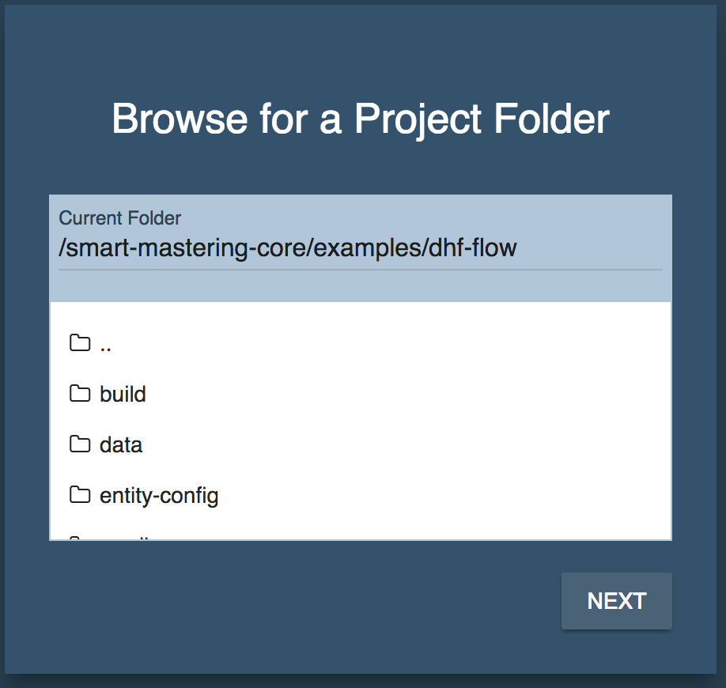
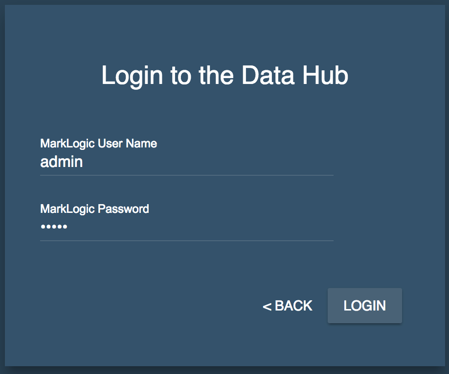
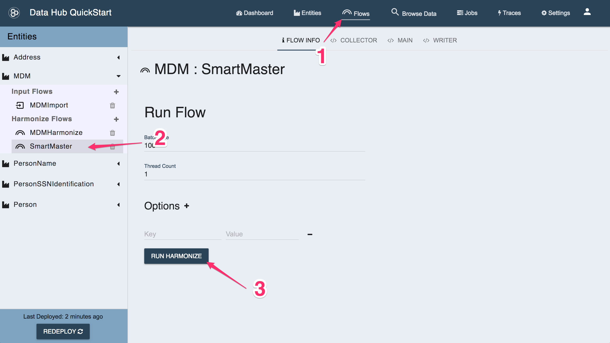

# Data Hub Framework Flow Example

This example shows you how to integrate Smart Mastering with your Data Hub Flows.

## Setup

### Configure Users (if necessary)

This project is set up to create a few roles and users with minimal privileges. 
To override the passwords set in **gradle.properties**, create a file called 
**gradle-local.properties** in the same directory as this README file. In that
file, add these lines:

```
mlSecurityUsername=admin
mlSecurityPassword=admin

mlUsername=mdm-user
mlPassword=mdm-user

mlRestAdminUsername=mdm-rest-admin
mlRestAdminPassword=mdm-rest-admin

mlAppAdminUsername=mdm-admin
mlAppAdminPassword=mdm-admin

mlManageUsername=mdm-manage
mlManagePassword=mdm-manage
```

The `mlSecurityUsername` user is used to create the other users and roles, so 
it must have the `admin` role or the `security` and `manage-admin` roles, 
provided with MarkLogic. 

Change the `mlSecurityPassword` to match your `admin` user password. 

To change the usernames or passwords for the other users, change them both in
**gradle-local.properties** and in **user-config/security/users/*.json**. 

### Run the Setup Command

- Open a Terminal or Command Prompt into this folder
- Setup the Example  
  **\*nix:** `./gradlew setupExample`  
  **windows:** `gradlew.bat setupExample`  

You have just installed a Data Hub Project into MarkLogic. You also loaded 3 data sets and harmonized them. If none of that makes sense, check out our [Data Hub Framework documentation](https://marklogic.github.io/marklogic-data-hub/).

## Mastering your Data

This example includes a Data Hub Harmonize Flow that will run Smart Mastering against your Harmonized data.

As with any DHF (Data Hub Framework) Harmonize flow you can run it via gradle or via the QuickStart application.

### Running via Gradle

- Open a Terminal or Command Prompt into this folder
- Run the Harmonize Flow  
  **\*nix:** `./gradlew hubRunFlow -PentityName=MDM -PflowName=SmartMaster`  
  **windows:** `gradlew.bat hubRunFlow -PentityName=MDM -PflowName=SmartMaster`  

### Running via QuickStart

- Download the [QuickStart Application](https://github.com/marklogic/marklogic-data-hub/releases)
- Run the QuickStart Application
  `java -jar quickstart-4.0.1.war`
- Open your browser to (http://localhost:8080)[http://localhost:8080]
- Browse to this directory and click **Next**  
  </img>
- Login with your MarkLogic credentials  
  </img>
- Click on the **Flows** tab  
- Drill down to the **MDM => Harmonize => SmartMaster** flow on the left  
- Click on the **Run Flow** button to start the flow  
  </img>

### What did I just do?

You just ran a [Harmonize Flow](https://marklogic.github.io/marklogic-data-hub/understanding/how-it-works/#harmonize-flows) which runs a function from the Smart Mastering code library: [process:process-match-and-merge](https://github.com/marklogic-community/smart-mastering-core/blob/master/src/main/ml-modules/com.marklogic.smart-mastering/process-records.xqy#L10).

If you like, you can read up on [how Smart Mastering works](https://marklogic-community.github.io/smart-mastering-core/how-does-it-work/).

Don't get overwhelmed by all the code in this project. To run Smart Mastering from a DHF Harmonize flow all you need to do is this:

```xquery
import module namespace process = "http://marklogic.com/smart-mastering/process-records"
  at "/com.marklogic.smart-mastering/process-records.xqy";

(:
 : this id is the uri of the document being processed
 : we are telling the Smart Mastering library to find matches
 : for this uri
 :)
process:process-match-and-merge($id)
```

All the other code in this project is necessary for a functioning Data Hub. We've purposely trimmed it down to bare essentials so you can focus on the Harmonization piece.

### Profiling this example

There are two profiling mechanisms available in this project. The first is the
built-in gradle profiler:

```
gradle --profile runMastering
```

This will write an HTML profile report to 
`./build/reports/profile/profile-$DATETIME.html`.

There's also a custom profiling class that prints per-task execution time to
the terminal:

```
gradle -Pprofile runMastering
```

Example output:

```
:runMastering
Running Flow: [MDM:SmartMaster]
        with batch size: 100
        with thread count: 4
        with Source DB: data-hub-STAGING
        with Destination DB: data-hub-FINAL


Output:
{
  "jobId" : "e8954555-a33c-465a-9664-d671ddde2930",
  "flowType" : "harmonize",
  "flowName" : "SmartMaster",
  "entityName" : "MDM",
  "jobName" : null,
  "startTime" : "2018-06-28T15:04:03.611Z",
  "endTime" : "2018-06-28T15:04:04.408Z",
  "jobOutput" : null,
  "status" : "FINISHED",
  "successfulEvents" : 7,
  "failedEvents" : 0,
  "successfulBatches" : 1,
  "failedBatches" : 0
}

BUILD SUCCESSFUL

Total time: 2.204 secs
Task timings:
     1.268s  :runMastering
```
