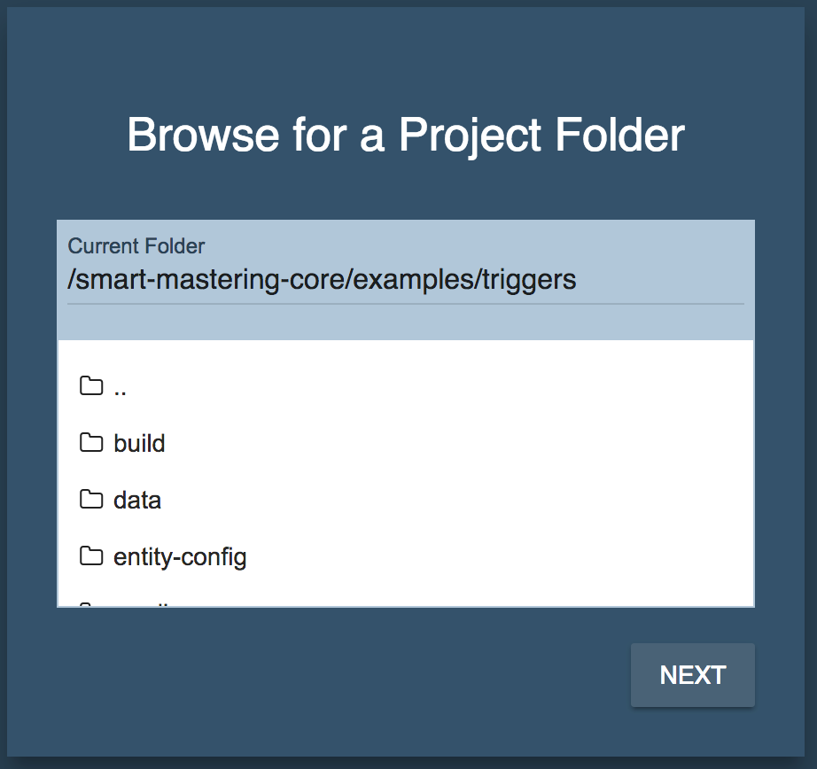
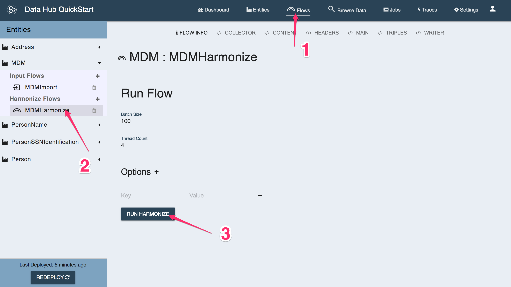

# Data Hub Framework Triggers Example

This example includes triggers that will run Smart Mastering against your data as it is harmonized.

## Setup

- Add your username and password to **gradle-local.properties**
  ```
  mlUsername=admin
  mlPassword=admin
  ```
- Open a Terminal or Command Prompt into this folder
- Setup the Example  
  **\*nix:** `./gradlew setupExample`  
  **windows:** `gradlew.bat setupExample`  

You have just installed a Data Hub Project into MarkLogic. You also loaded 3 data sets. If none of that makes sense, check out our [Data Hub Framework documentation](https://marklogic.github.io/marklogic-data-hub/).

## Mastering your Data

This example includes a Data Hub Harmonize Flow that will run Smart Mastering against your Harmonized data.

As with any DHF (Data Hub Framework) Harmonize flow you can run it via gradle or via the QuickStart application.

### Running via Gradle

- Open a Terminal or Command Prompt into this folder
- Run the Harmonize Flow  
  **\*nix:** `./gradlew hubRunFlow -PentityName=MDM -PflowName=MDMHarmonize`  
  **windows:** `gradlew.bat hubRunFlow -PentityName=MDM -PflowName=MDMHarmonize`  

### Running via QuickStart

- Download the [QuickStart Application](https://github.com/marklogic/marklogic-data-hub/releases)
- Run the QuickStart Application
  `java -jar quickstart-3.0.0.war`
- Open your browser to (http://localhost:8080)[http://localhost:8080]
- Browse to this directory and click **Next**  
  </img>
- Login with your MarkLogic credentials  
  </img>
- Click on the **Flows** tab  
- Drill down to the **MDM => Harmonize => MDMHarmonize** flow on the left  
- Click on the **Run Flow** button to start the flow  
  </img>

### What did I just do?

You just ran a [Harmonize Flow](https://marklogic.github.io/marklogic-data-hub/understanding/how-it-works/#harmonize-flows) which inserts a harmonized document into the Final Database. After insert, a trigger was fired by the system that runs a function from the Smart Mastering code library: [process:process-match-and-merge](https://github.com/marklogic-community/smart-mastering-core/blob/master/src/main/ml-modules/com.marklogic.smart-mastering/process-records.xqy#L10).

If you like, you can read up on [how Smart Mastering works](https://marklogic-community.github.io/smart-mastering-core/how-does-it-work/).

Don't get overwhelmed by all the code in this project. To run Smart Mastering from a trigger all you need to do is this:

Create a *.json file in the $hub/user-config/triggers/*.json

The file should look like this:
```json
{
  "name": "smart-mastering-create",
  "description": "my trigger",
  "event": {
    "data-event": {
      "collection-scope": {
        "uri": "mdm-content"
      },
      "document-content": {
        "update-kind": "create"
      },
      "when": "post-commit"
    }
  },
  "module": "com.marklogic.smart-mastering/match-and-merge-trigger.xqy",
  "module-db": "%%mlModulesDbName%%",
  "module-root": "/",
  "enabled": true,
  "recursive": true,
  "task-priority": "normal"
}
```

When you run the `gradle mlDeploy` command the triggers get configured for you. Similarly, the triggers are deployed when you use QuickStart to install your Hub.

All the other code in this project is necessary for a functioning Data Hub. We've purposely trimmed it down to bare essentials so you can focus on the Mastering piece.

